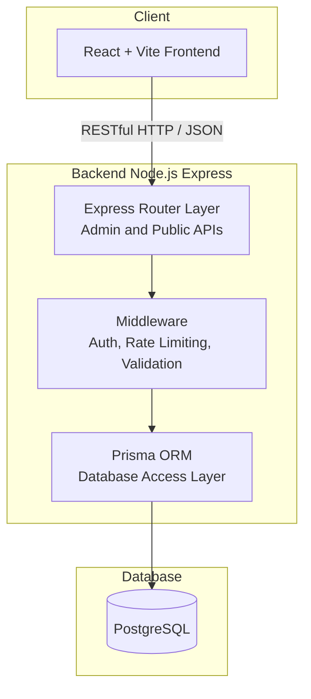

# L'Orange Rose Restaurant Management Platform
A full-stack web application built to power a real restaurant’s public website and admin dashboard.  
Includes content management (CRUD) and multilingual support.

##  Tech Stack

| Layer | Technology                           |
|-------|--------------------------------------|
| Frontend | **React (Vite + TypeScript)**     |
| Backend  | **Node.js + Express**             |
| Database | **PostgreSQL + Prisma ORM**       |
| Auth     | **JWT-based authentication**      |
| CI/CD    | **GitHub Actions → AWS Lightsail**|
| Docs     | **Swagger (OpenAPI 3.0)**         |

## Features
### Public Website
- Menu browsing and gallery
- Dynamic business hours & calendar for closures
- Customizable landing page image carousel
- Multilingual content (FR / NL / EN)
- Responsive, mobile-first design

### Admin Portal
- Role-based login (JWT)
- Menu item CRUD
- Gallery and announcement management
- Edit opening hours and contact details
- Real-time content preview before publishing

## System Architecture

## **API Overview**
### **AdminAnalytics**
> Endpoints for internal dashboard analytics (requires authentication)

| Method | Endpoint | Description |
|---------|-----------|-------------|
| `GET` | `/api/admin/analytics/summary` | Retrieves analytics summary data |
| `GET` | `/api/admin/analytics/series` | Retrieves time series analytics data |

---

### **AdminAnnouncements**
> Manage restaurant announcements (requires authentication)

| Method | Endpoint | Description |
|---------|-----------|-------------|
| `GET` | `/api/admin/announcements` | Get all announcements |
| `POST` | `/api/admin/announcements` | Create a new announcement |
| `PATCH` | `/api/admin/announcements/{id}` | Update an existing announcement |
| `DELETE` | `/api/admin/announcements/{id}` | Delete an announcement |

---

### **AdminClosures**
> Manage date-specific closures (requires authentication)

| Method | Endpoint | Description |
|---------|-----------|-------------|
| `GET` | `/api/admin/closures` | Get all closures |
| `POST` | `/api/admin/closures` | Create a new closure |
| `PATCH` | `/api/admin/closures/{id}` | Update a closure |
| `DELETE` | `/api/admin/closures/{id}` | Delete a closure |

---

### **AdminGallery**
> Manage gallery media (requires authentication)

| Method | Endpoint | Description |
|---------|-----------|-------------|
| `GET` | `/api/admin/gallery` | Get all gallery items |
| `POST` | `/api/admin/gallery` | Upsert a gallery item |
| `PATCH` | `/api/admin/gallery/{mediaAssetId}` | Update a gallery item |
| `DELETE` | `/api/admin/gallery/{mediaAssetId}` | Remove a gallery item |

---

### **AdminHours**
> Manage weekly business hours (requires authentication)

| Method | Endpoint | Description |
|---------|-----------|-------------|
| `GET` | `/api/admin/hours` | Get all business hours |
| `PUT` | `/api/admin/hours/{weekday}` | Update or create business hours for a specific weekday |

---

### **AdminMedia**
> Manage uploaded media assets (requires authentication)

| Method | Endpoint | Description |
|---------|-----------|-------------|
| `GET` | `/api/admin/media` | Get all media assets |
| `POST` | `/api/admin/media` | Upload a new media asset |
| `PATCH` | `/api/admin/media/{id}` | Update media metadata |
| `DELETE` | `/api/admin/media/{id}` | Delete a media asset |

---

### **AdminRecurringClosures**
> Manage recurring weekly closures (requires authentication)

| Method | Endpoint | Description |
|---------|-----------|-------------|
| `GET` | `/api/admin/recurring-closures` | Get all recurring closures |
| `POST` | `/api/admin/recurring-closures` | Create a new recurring closure |
| `PATCH` | `/api/admin/recurring-closures/{id}` | Update a recurring closure |
| `DELETE` | `/api/admin/recurring-closures/{id}` | Delete a recurring closure |

---

### **Announcements**
> Publicly accessible announcement endpoints

| Method | Endpoint | Description |
|---------|-----------|-------------|
| `GET` | `/api/announcements` | Retrieve all announcements |
| `POST` | `/api/announcements` | Create a new announcement |
| `PATCH` | `/api/announcements/{id}` | Update an existing announcement |
| `DELETE` | `/api/announcements/{id}` | Delete an announcement |

---

### **Auth**
> Authentication and session management

| Method | Endpoint | Description |
|---------|-----------|-------------|
| `POST` | `/api/auth/login` | Log in a user |
| `POST` | `/api/auth/logout` | Log out current user |
| `GET` | `/api/auth/me` | Get current authenticated user |

---

### **Closures**
> Public endpoints for retrieving closure information

| Method | Endpoint | Description |
|---------|-----------|-------------|
| `GET` | `/closures` | Retrieve closure information |

---

### **Gallery**
> Public endpoints for accessing published media

| Method | Endpoint | Description |
|---------|-----------|-------------|
| `GET` | `/api/gallery` | Retrieve published gallery items |

---

### Interactive documentation
Interactive documentation available via Swagger UI  
**[`/api-docs`](https://lorangerose.be/api-docs)**
